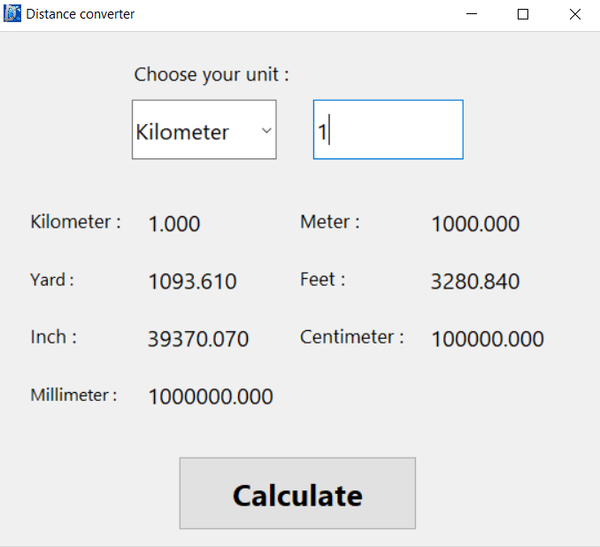

 **<h2 align="center">Distance-Converter</h2>**

Made with ❤️ in India

**<h2 align="center">  🚀<a href="https://replit.com/@ursmaheshj/Distance-Converter#main.py" target='blank'> Click here to try live demo.. </a></h2>**

    <a href="https://github.com/ursmaheshj/Distance-Converter/issues/new/choose" target="blank">Report Bug</a>
    ·
    <a href="https://github.com/ursmaheshj/Distance-Converter/issues/new/choose" target="blank">Request feature</a>
    ·
    <a href="https://github.com/ursmaheshj/Distance-Converter/issues/new/choose" target="blank">Initiate Idea</a>

## 🛠️ Installation Steps 

 > You can install Distance-Converter by two ways :
 
- **Using Installer** (Recommended)
  1. Download **[DistanceConverter.exe](https://github.com/ursmaheshj/Distance-Converter/raw/master/DistanceConverter.exe)** (setup) file.
  2. Double click the setup file to install.
  3. Browse your destination path and folder .
  4. Add desktop shortcut
  5. After successfull installation you are good to go.

- **Using Zip file** 
  1. Download **[DistanceConverter.zip](https://github.com/ursmaheshj/Distance-Converter/raw/master/DistanceConverter.zip)** file.
  2. Extract zip file anywhere. 
  3. Open extracted zip folder. 
  4. Run main.exe file.

## 🧐 Features
- Userfriendly design
- Simple and Elegant UI
- Gives accurate conversion values upto 3 decimal points
- Get all conversions with one click

## 💻 Built with
- [Python3](https://www.python.org/)
- [Tkinter](https://docs.python.org/3/library/tkinter.html)
- [PyInstaller](https://pyinstaller.readthedocs.io/en/stable/)
- [Inno Setup](https://jrsoftware.org/isinfo.php)
## 🍰 Contributing

Please contribute using [GitHub Flow](https://guides.github.com/introduction/flow); Create a branch, add commits, and [open a pull request](https://github.com/ursmaheshj/distance-Converter/compare).

## 🙏 Support
Dont hesitate to [fork](https://github.com/login?return_to=%2Fursmaheshj%2FDistance-Converter) this repository and give a [star](https://github.com/login?return_to=%2Fursmaheshj%2FDistance-Converter) if you like it..

